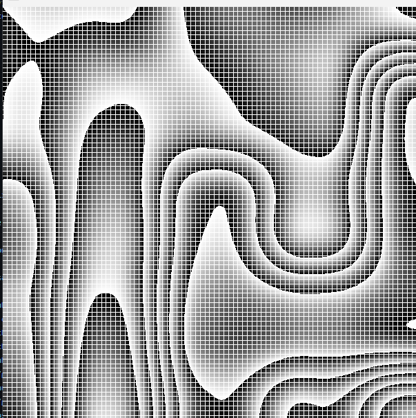

Dependencies
--------

This Program uses raylib for visualizing the algorithm, if you don't need to visualize
you can delete the "rl" import and every "rl." object on the project 
then you can run main and you should get and bin file with the f32 grid of the noise, and a png.

**a 2D perlin noise generator writen in go**
--------

Perlin noise is an algorithm for noise generation, the caracteristic of the algorithm is the smooth shape that it gives

