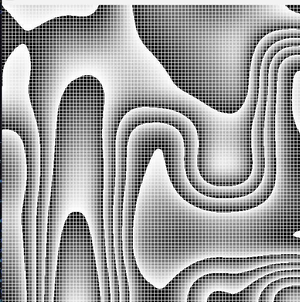

# Perlin (Go)

A small Go project that generates **2D Perlin-style noise** and exports it in two formats:

- `Noise.bin`: raw float32 grid data (little-endian)
- `Noise.png`: grayscale visualization of the generated noise

The program builds a noise grid, computes interpolated values from random gradient vectors, and writes both outputs to disk.

## Project structure

- `main.go`: noise generation and export logic
- `go.mod`: Go module definition
- `Images/PerlinNoise.png`: sample output image

## Current generation settings

Defined in `main.go` constants:

- Grid size: `GridArea = 1024` (`512 * 2`)
- Cell division: `VectorGridDiv = 256` (`128 * 2`)
- Effective vector grid ratio: `VectorGrid = 4`

## Requirements

- Go `1.23.2` or compatible toolchain

## Run

From the project directory:

```bash
go run .
```

This will create/update:

- `Noise.bin`
- `Noise.png`


## Preview


